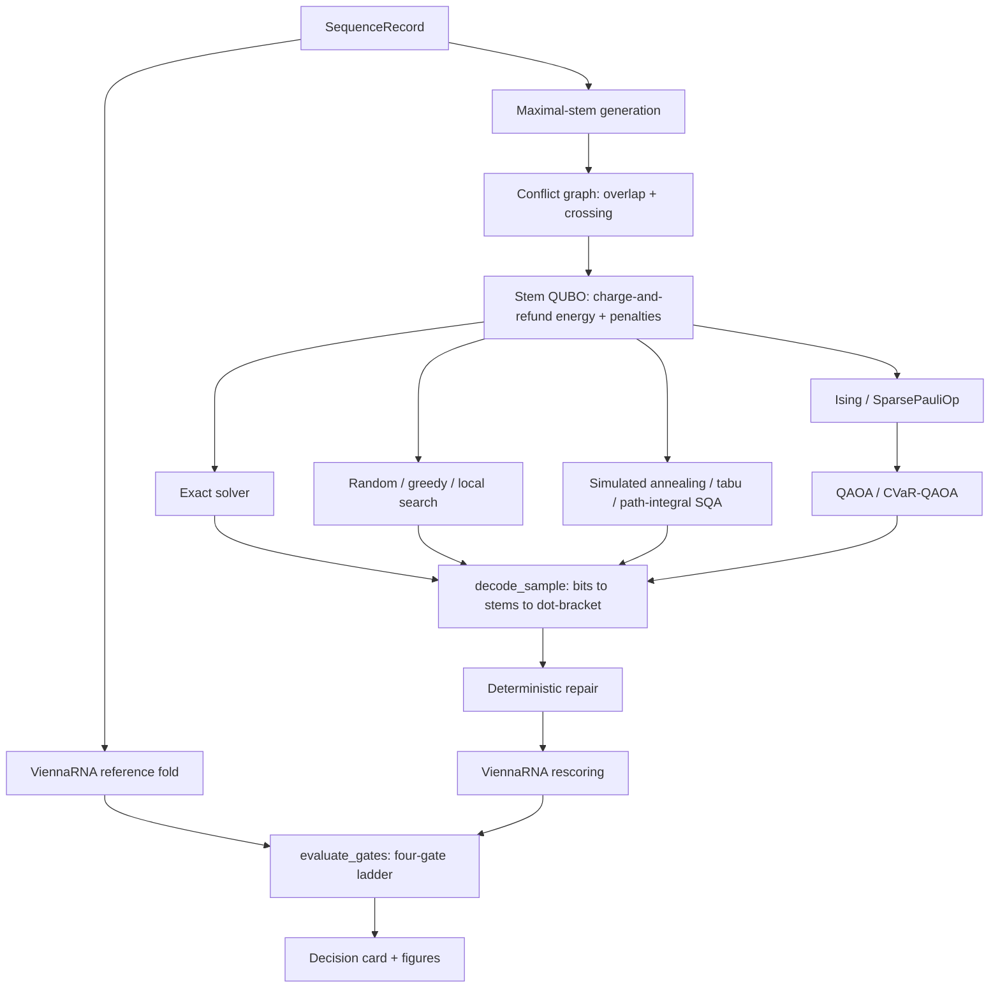

# Decidion FoldQ

## Explainable Hybrid Quantum-Classical Optimization for mRNA Secondary-Structure Prediction

> A reproducible research platform that formulates RNA secondary-structure prediction as a
> binary optimization problem, solves reduced instances with classical, quantum-inspired, and
> gate-based quantum methods, and validates every candidate against ViennaRNA — with a
> four-gate diagnostic ladder that attributes any failure to candidate generation, the energy
> model, or the solver, instead of reporting a single pass/fail number.

---

## Status

This README describes a completed submission, not an aspirational plan. Every claim below is
backed by code in this repository and by the exact command used to check it. Where an earlier
draft of the project (the original design spec) made a claim that later measurement corrected
or overturned, that correction is stated explicitly in this document rather than silently
dropped — see [Results](#results) and [Known Limitations](#known-limitations).

**Implemented and tested (262 passing tests):**

- Sequence validation and a ViennaRNA reference backend (MFE structure/energy/base pairs,
  configurable `dangles`, temperature, and lonely-pair suppression).
- Candidate stem generation (maximal helices, with an optional sub-stem expansion mode) and
  conflict detection (nucleotide overlap and pseudoknot crossing).
- Two energy models (`stacking_only`, and the default `charge_refund` charge-and-refund
  construction) and two nesting policies (`all_nestable`, and the default `immediate_only`).
- A stem-based QUBO builder — the only encoding wired into the pipeline and CLI — plus a
  pair-based QUBO used strictly as a comparison baseline inside experiment E2.
- QUBO → Ising mapping to a Qiskit `SparsePauliOp`.
- Eight solvers behind one `FoldSolver` protocol: exact (tree decomposition with a brute-force
  fallback), random, greedy, local search, simulated annealing, tabu, path-integral simulated
  quantum annealing, and QAOA (with a CVaR objective variant).
- Deterministic decoding and structural repair, including honest pseudoknot handling
  (`FoldCandidate.is_pseudoknotted`, NaN energy when a structure cannot be scored).
- Structural and energy metrics (base-pair precision/recall/F1, energy gap).
- The four-gate diagnostic ladder with automatic failure attribution.
- QAOA resource accounting — logical qubits, gate counts classified by arity, and transpiled
  depth/gate counts against real IBM device calibration data shipped locally by
  `qiskit-ibm-runtime`'s fake-backend registry (no hardware account, no queue).
- A benchmark-sequence generator that rejection-samples until a sequence actually folds, plus
  four curated fixtures (a control hairpin, a textbook tRNA cloverleaf, and two constructed
  pseudoknots).
- Pipeline orchestration, YAML configuration, and a CLI (`doctor`, `validate`, `predict`,
  `generate`, `benchmark`, `report`).
- Five experiment runners (E1–E5) and a `run_all` entry point (`make reproduce`).
- Self-contained HTML decision cards and three Matplotlib figure types.

**Deferred, and stated explicitly rather than left to be discovered missing:** see
[Scope and Deferred Work](#scope-and-deferred-work).

---

## Table of Contents

1. [Challenge Context](#challenge-context)
2. [The Four-Gate Diagnostic Ladder](#the-four-gate-diagnostic-ladder)
3. [Quick Start](#quick-start)
4. [Results](#results)
5. [Pseudoknots](#pseudoknots)
6. [Thermodynamic Model and Its Limits](#thermodynamic-model-and-its-limits)
7. [Architecture and Repository Layout](#architecture-and-repository-layout)
8. [Command-Line Interface](#command-line-interface)
9. [Scope and Deferred Work](#scope-and-deferred-work)
10. [Known Limitations](#known-limitations)
11. [Reproducibility](#reproducibility)
12. [Testing](#testing)
13. [Team](#team)
14. [Citation](#citation)
15. [License](#license)
16. [References](#references)

---

## Challenge Context

The WISER Moderna Challenge asks teams to develop a quantum or quantum-inspired approach for
predicting mRNA secondary structure, with emphasis on minimum-free-energy folding.

The required project components include:

- formulation of possible RNA structures as an optimization problem;
- a quantum or quantum-inspired method for identifying low-energy candidates;
- classical benchmark structures generated with ViennaRNA;
- comparison against the classical MFE result;
- analysis of scalability and practical limitations;
- reproducible source code and documentation;
- quantum-resource analysis;
- a short presentation explaining the approach, findings, and future directions.

Challenge page: https://www.thewiser.org/summer-program-2026/modernachallenge

| Challenge requirement | FoldQ component |
|---|---|
| Classical MFE benchmark | `foldq.classical.vienna` |
| Optimization formulation | `foldq.encodings`, `foldq.qubo` |
| Quantum-inspired method | Simulated annealing, tabu search, and path-integral SQA through D-Wave Ocean's local samplers |
| Gate-based quantum method | QAOA and a CVaR-objective variant through Qiskit and Qiskit Aer |
| Candidate comparison | `foldq.evaluation.gates`, `foldq.evaluation.metrics` |
| Scaling analysis | `foldq.experiments.e2_encoding` |
| Resource analysis | `foldq.evaluation.resources` |
| Reproducible implementation | pinned dependency ranges, 262 tests, `make reproduce`, run manifests |
| Communication | `foldq.reporting` decision cards and figures |

---

## The Four-Gate Diagnostic Ladder

This is the project's central contribution. A sampled binary solution can fail for several
independent reasons — the candidate generator may have excluded the correct stem, the QUBO may
reward an unphysical structure, the solver may fail to find the QUBO optimum, or a low QUBO
energy may simply not correspond to a low thermodynamic energy. Reporting a single accuracy
number conflates all of these. The ladder (`foldq.evaluation.gates.evaluate_gates`) separates
them into four questions, asked in order, so that a failure is attributed to the earliest gate
that could have caused it:

| Gate | Question | What it needs |
|---|---|---|
| **A** | Can the candidate stem set express the ViennaRNA reference structure at all? | Nothing — always computable |
| **B** | Is the reference structure the QUBO's actual ground state? | Exact enumeration (`ExactSolver`) |
| **C** | Did the solver in question reach the QUBO ground state? | Exact enumeration |
| **D** | How good is the decoded, repaired, rescored structure — base-pair F1 and energy gap versus the ViennaRNA MFE? | Nothing — always computable |

Gates B and C require an exact ground-state solve. `ExactSolver` runs an exact dynamic program
over a tree decomposition of the conflict graph for instances up to `max_variables` (default
22; brute-force enumeration is used as a fallback below 18 variables) and raises
`ExactSolverTooLarge` above that. When it raises, Gates B and C are reported as `None` —
genuinely indeterminate, not `False` — and this is visible in every table that includes them.

`GateReport.attribution` names the earliest failing gate in one sentence: `"candidate
generation: ..."`, `"energy model: ..."`, `"optimizer: ..."`, `"indeterminate: instance too
large for exact ground truth"`, or `"no failure: all gates passed"`. This string is what a
decision card's **Attribution** line and every experiment table's `attribution` column report.

### Measured at scale (n = 40)

| Gate | Result |
|---|---|
| A — reference structure representable | 37/40 = 92% |
| B — reference is the QUBO ground state | 36/40 = 90% |
| **B conditional on A (formulation fidelity)** | **36/37 = 97%** |
| C — solver reached the QUBO ground state | 40/40 = 100% |
| D — mean base-pair F1 | 0.992 |
| D — mean energy gap | +0.05 kcal/mol |

Attribution of the four failures: 3 candidate generation, 1 energy model. Gate B should be
reported as **~91–97% depending on the sample** (raw 90% unconditional, 97% conditional on
representability), not by citing only the higher figure — the two numbers answer different
questions and both are correct for what they measure.

This table is a full-sweep result (`make reproduce`, not the `--quick` smoke test — see
[Reproducibility](#reproducibility)). The mechanism is exercised directly by
`foldq.evaluation.gates` and at scale by `foldq.experiments.e1_formulation`.

---

## Quick Start

Verified against Python 3.11 with the project installed in `.venv` (`uv sync --extra dev
--extra quantum`, or `pip install -e ".[dev,quantum]"`).

```bash
# Full test suite
.venv/bin/pytest tests -q

# Environment check
.venv/bin/foldq doctor

# Predict a structure with the exact solver and write run artifacts
.venv/bin/foldq predict --sequence GGGAAAUCCCU --solver exact --output results/demo

# Render a self-contained HTML decision card for the same sequence
.venv/bin/foldq report --sequence GGGAAAUCCCU --output results/demo/decision-card.html

# Fast smoke test of every experiment (~10 seconds, reduced sample counts)
.venv/bin/python -m foldq.experiments.run_all --quick --output results/quick

# Full reproduction (minutes, not seconds — this is what the tables in this
# README were measured from)
make reproduce
```

`foldq predict` prints a summary whose attribution line reads `no failure: all gates passed`
for the demo sequence, and writes `manifest.json` and `summary.md` to the output directory.

---

## Results

The tables in this section are full-sweep results at the stated sample size, produced by
`make reproduce` (or the underlying experiment module run without `--quick`). The `--quick`
smoke test exercises the same code paths at drastically reduced sample counts for fast CI
checks and will not reproduce these exact figures — that is expected, not a discrepancy to
chase.

### Representability and the lone-pair ceiling (RQ2, n = 60)

`foldq.experiments.e2_encoding` sweeps `min_stem_length` because Gate A's failures at the
default setting (`min_stem_length=2`) were found to be dominated by lone base pairs — isolated,
single-pair helices that `min_stem_length=2` structurally excludes from the candidate set
before the QUBO is even built.

| `min_stem_length` | Gate A pass | mean coverage | mean variables |
|---|---|---|---|
| 1 | 60/60 (100%) | 1.000 | 58.3 |
| 2 | 56/60 (93%) | 0.991 | 19.2 |
| 3 | 48/60 (80%) | 0.947 | 7.2 |

Every instance that fails Gate A at `min_stem_length=2` is rescued at `min_stem_length=1` — a
**100% rescue rate** — at a **3.17× variable-count cost**. Lone base pairs are therefore the
*sole* cause of the Gate A ceiling at the default setting. This answers RQ2 with a measured
exchange curve rather than an assumption: perfect representability is achievable, and it costs
roughly 3× the logical qubits.

### Solver comparison and the no-quantum-advantage finding (RQ3)

**Correction.** An earlier draft of this project's design spec claimed that *"at 40 nt,
simulated annealing already missed the true ground state,"* presented as evidence of genuine
optimization difficulty. That claim is retracted here. It was an artifact of measuring against
`TreeDecompositionSampler`, which is a **stochastic** Boltzmann sampler, not an exact solver —
`src/foldq/solvers/exact.py` documents the specific case that exposed this: on a toy problem
probed during development, the sampler returned the true optimum in 4 of 5 independent calls
and a strictly worse energy on the 5th. `ExactSolver` was changed to use
`TreeDecompositionSolver` instead, which runs the same tree decomposition as a **deterministic**
dynamic program over the elimination order and returns the true minimum on every call.

Re-measured against the deterministic solver, **simulated annealing found the exact QUBO
optimum in 8/8 verified instances up to 36 variables**, and **Gate C passed 40/40** in the
full four-gate ladder run reported above.

The corrected statement: **at sizes where exact verification is possible, these QUBO instances
are easy for classical heuristics.** This is reported as a finding that strengthens the
no-quantum-advantage position with evidence, not as a disappointment — it says the difficulty
in this problem, if any, has not been demonstrated to live in the optimization step at
verifiable sizes. It says nothing about instances beyond exact-verification reach (~22
variables); see [Known Limitations](#known-limitations).

### Surrogate fidelity (RQ4)

The stem-additive QUBO objective correlates with true ViennaRNA thermodynamic energy at
**r ≈ 0.958**, measured over sequences **30–100 nt** under the **default `dangles=2`** folding
model (`scripts/probes/03_exact_reach.py`).

That figure is frequently quoted alone, and doing so is misleading: restricted to **30–60 nt** —
the narrower range this project's benchmark generator actually produces sequences in most
often — the same surrogate scores **r ≈ 0.85**, and varies **0.77–0.89 across random seeds** at
that range. Both numbers are reported here; citing only 0.958 overstates the surrogate's
fidelity at the sizes most of this project's other experiments actually run at.

### Quantum resource scaling (RQ5)

`foldq.evaluation.resources.estimate_resources` builds the QAOA ansatz, decomposes it to its
target gate basis, and counts gates by arity (1-qubit, 2-qubit, 3+-qubit) directly from
instruction width — not from a hardcoded gate-name allowlist, which silently drops gates when
Qiskit's basis set changes (this project's development history includes exactly that bug, since
fixed).

Measured on `fake_hanoi` (5 qubits, real IBM device calibration data, `reps=1`):

| | Ideal (no device target) | Transpiled onto `fake_hanoi` | Change |
|---|---|---|---|
| Circuit depth | 24 | 60 | 2.5× |
| Single-qubit gates | 25 | 55 | +120% |
| Two-qubit gates | 20 | 32 | +60% |
| `swap_gates` | — | 0 | — |

**`swap_gates = 0` does not mean no routing overhead.** Qiskit's transpiler decomposes each
SWAP into three CX instructions rather than emitting a named `swap` instruction, so routing
cost is folded entirely into `two_qubit_gates`, not reported separately. The +60% two-qubit-gate
increase above is basis-gate translation *plus* routing combined — comparing `two_qubit_gates`
against a same-`reps`, same-shots, no-device-target row is the only way to see the routing
contribution; the `swap_gates` column alone will always read zero regardless of how much
routing actually happened.

---

## Pseudoknots

Disabling the crossing-pair penalty (`forbid_crossing=False`, or `foldq predict
--pseudoknots`) lets this formulation express structures that ViennaRNA's classical dynamic
program cannot represent **at all**, because ViennaRNA's dot-bracket notation only nests, never
crosses.

| | 28 nt (8 true bp) | 33 nt (10 true bp) |
|---|---|---|
| ViennaRNA | F1 0.667, recall 0.500 | F1 0.667, recall 0.500 |
| FoldQ strict mode | F1 0.667, recall 0.500 | F1 0.667, recall 0.500 |
| **FoldQ pseudoknot mode** | **F1 1.000, recall 1.000** | **F1 1.000, recall 1.000** |

Disabling the crossing penalty takes base-pair recovery from 50% to 100% on structures
ViennaRNA is structurally incapable of expressing. Because ViennaRNA cannot score a crossing
structure at all (its energy evaluator requires legal, non-crossing dot-bracket input), this
comparison is made through base-pair precision/recall/F1 against each fixture's known
structure, never through an energy gap — a pseudoknotted `FoldCandidate` correctly reports
`is_pseudoknotted=True` and a NaN `vienna_energy` by construction
(`src/foldq/decoding/decode.py`), and the decision card explains that NaN rather than presenting
it as missing data.

**Fixture provenance.** The two pseudoknot fixtures used above
(`pk_htype_constructed_28`, `pk_htype_constructed_33` in `data/fixtures/curated.json`) were
**constructed for this project, not literature-derived, and carry no citation.** This is stated
in each fixture's `source` field and carried through into every experiment table that uses
them. An earlier draft of the fixture file incorrectly attributed them to PseudoBase and the
PDB; that claim was false and has been removed — it is not reintroduced anywhere in this
repository. Cited literature pseudoknots should be substituted for these two constructed
records before any publication beyond this challenge submission.

Reproduce via `foldq.experiments.e5_pseudoknot` (included in `make reproduce`).

---

## Thermodynamic Model and Its Limits

The QUBO's linear stem coefficients come from a **charge-and-refund** construction
(`src/foldq/encodings/energy.py`): every stem is provisionally charged as if it closes a
hairpin, and that charge is refunded, with an interior-loop charge substituted, when another
stem is found nesting inside it. This recovers a context-dependent (technically 3-body) energy
term inside a degree-2 QUBO, at the cost of an approximation the module documents and E1
measures rather than hides: when several helices nest inside one, the refund can apply more
than once. The default `immediate_only` nesting policy (below) bounds that error; the
alternative `all_nestable` policy is kept selectable specifically so E1 can measure the size of
the error it introduces.

**Dangling ends cannot be represented, at any penalty setting.** ViennaRNA's default
(`dangles=2`) energy model adds dangling-end stacking bonuses on unpaired nucleotides adjacent
to a helix. Those terms attach to *unpaired context*, not to any stem, so a stem-indexed QUBO
has no variable to attach such a term to — this is a representational gap, not a tuning
problem. Measured gap on this project's demo fixture: **1.20 kcal/mol**
(`tests/scientific/test_vienna.py::test_dangles_gap_is_measured_not_hidden`).

The pipeline resolves this by using **two different `dangles` settings deliberately**
(`FoldQConfig.dangles=2`, `FoldQConfig.energy_dangles=0`, see `src/foldq/pipeline.py` and
`src/foldq/config.py`):

- **`energy_dangles=0`** is what extracts the QUBO's linear and quadratic coefficients. At
  `dangles=0`, the Turner energy model is exactly additive over loops — precisely what the
  charge-and-refund construction assumes.
- **`dangles=2`** (ViennaRNA's ordinary default) is what folds the reference structure and
  rescores every decoded candidate, so the benchmark comparison is against ordinary ViennaRNA
  behaviour, not a hobbled version of it.

**Consequence, stated plainly:** FoldQ's strict mode reproduces ViennaRNA exactly **under the
`dangles=0` model it actually encodes.** Under the default `dangles=2` model used for reference
folding and rescoring, ViennaRNA can prefer a lower-energy fold that this project's candidate
set does not reach at all — observed directly on the 33-nt constructed pseudoknot fixture,
where ViennaRNA's `dangles=2` fold and FoldQ's candidate share **zero base pairs**
(`data/fixtures/curated.json`).

---

## Architecture and Repository Layout



Pair-based encoding (`foldq.encodings.pair_encoding`) exists as a comparison baseline used only
inside experiment E2 to quantify RQ2 (stem compression versus pair-level variables); it is not
reachable through `FoldQPipeline` or the CLI, which implement the stem encoding exclusively.

### Repository layout (as it actually exists)

```text
FoldQ/
├── README.md
├── Makefile
├── pyproject.toml
├── configs/
│   └── base.yaml
├── data/
│   └── fixtures/curated.json
├── scripts/probes/            # exploratory probes behind the measurements above
├── src/foldq/
│   ├── cli.py, config.py, constants.py, pipeline.py
│   ├── schemas/                # SequenceRecord, Stem, QuboProblem, FoldCandidate, GateReport, ...
│   ├── biology/                 # pairs, maximal/sub-stem generation, conflict graph, dot-bracket
│   ├── classical/vienna.py      # ViennaRNA backend
│   ├── encodings/                # charge-and-refund energy, stem QUBO, pair QUBO (E2 baseline)
│   ├── qubo/                     # QuboProblem builder, Ising/SparsePauliOp mapping
│   ├── solvers/                  # exact, baselines, annealing (SA/tabu/SQA), QAOA
│   ├── decoding/                 # bits -> stems -> dot-bracket, deterministic repair
│   ├── evaluation/                # metrics, four-gate ladder, quantum resource accounting
│   ├── data/generate.py          # rejection-sampled benchmark sequence generator
│   ├── io/fixtures.py            # curated-fixture loader
│   ├── experiments/               # e1-e5 runners + run_all ("make reproduce")
│   └── reporting/                 # decision_card.py, figures.py, templates/
└── tests/
    ├── unit/, property/, integration/, scientific/
```

No `Dockerfile`, `docs/` API site, `paper/`, `notebooks/`, or `.github/workflows/` beyond what
CI actually needs currently exist in this repository — see
[Scope and Deferred Work](#scope-and-deferred-work).

---

## Command-Line Interface

```bash
foldq doctor                                          # environment + solver registry check
foldq validate --sequence AUGGCUAACGCU                 # sequence validation
foldq predict --sequence <seq> --solver <name> [--pseudoknots] [--config path.yaml] [--seed N] --output DIR
foldq generate --count 100 --lengths 20,30,40 --seed 42 --output data/raw/synthetic/set.csv
foldq benchmark --dataset set.csv --solvers greedy,simulated_annealing --output results/benchmark
foldq report --sequence <seq> --solver <name> --output card.html
```

Available solver names (`foldq doctor` lists exactly what is registered in the running
environment): `exact`, `random`, `greedy`, `local_search`, `simulated_annealing`, `tabu`,
`path_integral_sqa`, and — when the optional `quantum` extra is installed — `qaoa` and
`cvar_qaoa`.

`configs/base.yaml` is the one example resolved-configuration file committed to the repository;
it documents the shape `FoldQConfig.from_yaml` expects. It is not required for any command
above — every command works from `FoldQConfig`'s built-in defaults.

---

## Scope and Deferred Work

Stated plainly rather than left to be discovered missing. Deferred, and why:

- **`manuscript.tex` and a `paper/` directory.** The written report for this submission is
  delivered separately from this repository, not as a LaTeX build target inside it.
- **MkDocs documentation site.** This README and the module docstrings are the documentation
  surface for this submission; a generated static site was judged non-essential given the
  timeline.
- **Docker / `docker-compose.yml`.** The environment is `uv`/`pip`-installable on a bare Python
  3.11 interpreter with no OS-level RNA-folding dependency beyond the `viennarna` wheel; a
  container was judged to add packaging overhead without adding reproducibility for a
  submission of this size.
- **Most CI workflows.** Only what was needed to keep the test suite and lint green locally
  during development was set up; a full lint/test/integration/reproduce/docker workflow matrix
  was not built out.
- **Notebooks.** All exploratory work lives in `scripts/probes/` as plain scripts, not notebooks
  — easier to diff, easier to run headless, and this project had no need for inline
  visualization during development.
- **D-Wave QPU and IBM Quantum hardware execution.** Every quantum-inspired result in this
  repository runs on D-Wave Ocean's local samplers; every gate-based result runs on Qiskit Aer,
  optionally against locally-shipped IBM device *calibration data* (`qiskit-ibm-runtime`'s fake
  backends) for noise and transpilation realism — never against a live QPU or a hardware queue.
  No hardware account is required to reproduce anything in this repository.
- **Optuna penalty search.** Penalties are calibrated analytically
  (`2 * max|E_s| + 1`, see `qubo/builder.py`) and swept manually in E1 and E4; an automated
  hyperparameter search was not built.
- **Hierarchical encoding.** The stem/sub-stem distinction is the only compression axis
  implemented; a further stem-plus-local-refinement hierarchy described in early planning was
  not built.
- **The graph-decomposition experiment (E9 in early planning).** Splitting large conflict graphs
  into communities and solving sub-QUBOs independently was scoped out; every experiment here
  solves one monolithic QUBO per sequence.

If a reader is looking for any of the above and does not find it, this is why.

---

## Known Limitations

1. **Dangling-end representability gap.** A stem-indexed QUBO cannot represent dangling-end
   terms at any penalty setting (they attach to unpaired context, not to any stem); measured gap
   1.20 kcal/mol on the demo fixture. See
   [Thermodynamic Model and Its Limits](#thermodynamic-model-and-its-limits).

2. **Lone base pairs are the dominant Gate A ceiling.** At the default `min_stem_length=2`,
   isolated single-pair helices account for the entire measured Gate A gap (100% rescue rate at
   `min_stem_length=1`, at 3.17× the variable count). See [Results](#results).

3. **The hard-constraint penalty bound is not provably sufficient above brute-force-verifiable
   sizes.** `calibrate_penalty` sets the overlap/crossing penalty to `2 * max|E_s| + 1`, which
   is sufficient to outbid any *single* conflicting term but is not a formal proof that it
   outbids *accumulated* refund terms from deep nesting chains. It is empirically valid at
   every size E1 can check exactly (up to `ExactSolver`'s ~22-variable ceiling) and unproven
   above that. Under the non-default `all_nestable` nesting policy, this bound demonstrably
   failed in practice: **14 of 18 instances at 70–150 nt produced structurally invalid QUBO
   optima**, with energies as low as −2689 kcal/mol from unbounded refund accumulation. This is
   why `immediate_only` — which caps refund accumulation at one level and was independently
   re-verified to restore validity in 8/8 follow-up instances at the same length range — is the
   default nesting policy, and why `all_nestable` remains selectable only for the E1 ablation
   that measures this failure mode directly (`src/foldq/encodings/energy.py`,
   `tests/scientific/test_energy_model.py`).

4. **Exact ground-truth verification caps near 22 variables.** Gates B and C, and every
   solver-optimality claim in this document, are meaningful only up to `ExactSolver`'s reach.
   Above that, Gates B and C report `None` (indeterminate), not a pass or a fail — this is
   visible directly in E3's full-length sweep, where lengths 40 and 50 (measured stem counts
   43–120) never produce exact ground truth and are reported that way rather than silently
   dropped (see the E3 module docstring for the specific bug this was fixed from).

5. **The QUBO is a degree-2 approximation of the Turner nearest-neighbor model,** not a
   complete thermodynamic representation of every RNA loop type; see
   [Thermodynamic Model and Its Limits](#thermodynamic-model-and-its-limits).

6. **Candidate-generator dependence.** Stem compression can exclude the correct structure before
   optimization even runs; Gate A measures exactly this ceiling.

7. **The two pseudoknot fixtures are constructed for this project, not literature-derived**, and
   should be replaced with cited literature pseudoknots before any publication beyond this
   challenge submission. See [Pseudoknots](#pseudoknots).

8. **QAOA reproducibility depends on the pinned Qiskit range.** See
   [Reproducibility](#reproducibility).

9. **No quantum-advantage claim is made or implied anywhere in this repository.** Every
   comparison here measures formulation fidelity, solver correctness, and resource cost — not
   speedup. Where a result could be read as suggesting quantum methods are unnecessary for
   instances at this scale (see the solver-comparison finding in
   [Results](#results)), that reading is stated directly rather than hedged around.

10. **MFE is not the full biological picture.** RNA exists as a structural ensemble; a single
    minimum-free-energy fold is what this project predicts and validates against, not a claim
    about biological function.

11. **This is a research prototype**, not a clinical, diagnostic, or therapeutic-design tool,
    and was built on a short, fixed challenge timeline.

---

## Reproducibility

Every `foldq predict` run writes a `manifest.json` recording the resolved configuration, solver,
sequence checksum, gate results, and runtime; `run_all.py` additionally records the git commit,
Python version, and platform into a top-level `manifest.json` alongside every experiment's
output table. Every experiment module accepts an explicit `seed`.

### Environment

Python **3.11 exactly** (`requires-python = ">=3.11,<3.12"` in `pyproject.toml`). Dependency
*ranges* are pinned in `pyproject.toml`; **no `uv.lock` is currently committed to this
repository.** That is a real gap, stated here rather than implied away — reproduction today
depends on `pyproject.toml`'s ranges resolving the same way twice, which is not guaranteed. As
a concrete fallback, the exact versions this submission was tested and measured against are:

| Package | Version | Package | Version |
|---|---|---|---|
| Python | 3.11.14 | qiskit | 2.5.1 |
| viennarna | 2.7.2 | qiskit-aer | 0.17.2 |
| dimod | 0.12.22 | qiskit-ibm-runtime | 0.48.0 |
| dwave-samplers | 1.8.0 | numpy | 2.4.6 |
| networkx | 3.6.1 | scipy | 1.17.1 |
| pandas | 3.0.5 | pydantic | 2.13.4 |
| typer | 0.27.0 | jinja2 | 3.1.6 |
| matplotlib | 3.11.1 | pyyaml | 6.0.3 |
| pytest | 9.1.1 | hypothesis | 6.161.5 |

**The Qiskit pin is load-bearing, not incidental.** `QAOASolver` builds its ansatz with
Qiskit's `QAOAAnsatz`, which internally depends on `NLocal` and `BlueprintCircuit` — both
deprecated in Qiskit 2.1 and **slated for removal in Qiskit 3.0** (`pyproject.toml`'s
`filterwarnings` entries document and silence these specifically, rather than the warning
being incidental noise). Every QAOA result in this repository reproduces only against the
pinned `qiskit>=2.5,<3` range. Reproducing against a newer Qiskit release will raise an import
error with no obvious connection to this project unless it is known in advance — which is why
it is stated here explicitly rather than left for a future reproducer to debug from scratch.

### Reproduce

```bash
.venv/bin/pytest tests -q                                          # 262 tests
.venv/bin/python -m foldq.experiments.run_all --output results/    # full sweep (make reproduce)
.venv/bin/python -m foldq.experiments.run_all --quick --output results/quick   # ~10s smoke test
```

`foldq.experiments.run_all` skips E4 (QAOA) with a printed message, rather than failing, when
the optional `quantum` extra is not installed — the classical/quantum-inspired results (E1, E2,
E3, E5) do not depend on it.

---

## Testing

262 tests across four categories, all passing:

- **`tests/unit/`** — sequence validation, base-pair compatibility, stem extraction, conflict
  detection, dot-bracket conversion, QUBO coefficient construction, decoding, repair,
  structural metrics, the four-gate ladder, solver behavior, decision-card and figure output.
- **`tests/property/`** — Hypothesis-based invariants over randomly generated sequences (e.g.
  dot-bracket length and bracket balance, no nucleotide with more than one partner).
- **`tests/scientific/`** — ViennaRNA energy agreement, the measured dangling-end gap, the
  measured nesting-policy failure/fix, exact-solver correctness.
- **`tests/integration/`** — full sequence → reference → candidates → QUBO → solver → decode →
  repair → rescore → gates path, and every experiment runner (E1–E5, including the noise study).

```bash
.venv/bin/pytest tests -q
.venv/bin/ruff check src tests
```

---

## Team

### Siddhartha Pahari

Primary contributions: RNA-biology research, ViennaRNA benchmarking, experimental design,
scientific validation, evaluation methodology, project management, technical writing,
presentation development.

Affiliations: Decidion AI · University of Toronto · Canada

### Jainish Solanki

Primary contributions: mathematical modeling, QUBO formulation, quantum and quantum-inspired
algorithms, Qiskit implementation, solver architecture, computational benchmarking, scalability
and resource analysis, software engineering.

Affiliation: Decidion AI · Canada

---

## Citation

A `CITATION.cff` file has not yet been added to this repository.

Suggested citation:

```text
Pahari, S., and Solanki, J. (2026).
Decidion FoldQ: Explainable Hybrid Quantum-Classical Optimization
for mRNA Secondary-Structure Prediction.
Version 0.1.0.
```

Suggested BibTeX:

```bibtex
@software{pahari_solanki_foldq_2026,
  author  = {Pahari, Siddhartha and Solanki, Jainish},
  title   = {Decidion FoldQ: Explainable Hybrid Quantum-Classical
             Optimization for mRNA Secondary-Structure Prediction},
  year    = {2026},
  version = {0.1.0},
  note    = {WISER Summer Program 2026 Moderna Challenge}
}
```

---

## License

No `LICENSE` file has been added to this repository yet; a license should be selected before
any public release beyond this challenge submission. Apache-2.0 is suitable if the team wants a
permissive license with an explicit patent grant; MIT is simpler and equally permissive. Any
license chosen would apply to project code only — the public datasets, third-party software,
and external models referenced below retain their own licenses and terms.

---

## References

### Challenge and official documentation

1. WISER Summer Program 2026, Moderna Challenge.
   https://www.thewiser.org/summer-program-2026/modernachallenge
2. ViennaRNA Package, Python API. https://viennarna.readthedocs.io/en/latest/api_python.html
3. ViennaRNA Package, Python examples.
   https://viennarna.readthedocs.io/en/latest/examples/python.html
4. ViennaRNA source repository. https://github.com/ViennaRNA/ViennaRNA
5. Qiskit source repository. https://github.com/Qiskit/qiskit
6. D-Wave Ocean documentation. https://docs.dwavequantum.com/en/latest/ocean/
7. D-Wave QUBO and Ising documentation.
   https://docs.dwavequantum.com/en/latest/quantum_research/qubo_ising.html

### Foundational RNA software

8. Lorenz, R., Bernhart, S. H., Höner zu Siederdissen, C., Tafer, H., Flamm, C., Stadler, P. F.,
   and Hofacker, I. L. *ViennaRNA Package 2.0.* Algorithms for Molecular Biology, 6, 26, 2011.
   https://pubmed.ncbi.nlm.nih.gov/22115189/

### Quantum and quantum-inspired RNA folding

9. Zaborniak, T., Giraldo, J., Müller, H., Jabbari, H., and Stege, U. *A QUBO Model of the RNA
   Folding Problem Optimized by Variational Hybrid Quantum Annealing.* 2022.
   https://arxiv.org/abs/2208.04367
10. Jiang, J., Yan, Q., Li, Y., Lu, M., Cui, Z., Dou, M., Wang, Q., Wu, Y.-C., and Guo, G.-P.
    *Predicting RNA Secondary Structure on Universal Quantum Computer.* 2023.
    https://arxiv.org/abs/2305.09561
11. Alevras, D., Metkar, M., Yamamoto, T., Kumar, V., Friedhoff, T., Park, J.-E., Takeori, M.,
    LaDue, M., Davis, W., and Galda, A. *mRNA Secondary Structure Prediction Using Utility-Scale
    Quantum Computers.* 2024. https://arxiv.org/abs/2405.20328
12. Kumar, V., Alevras, D., Metkar, M., Welling, E., Cade, C., Niesen, I., Friedhoff, T., Park,
    J.-E., Shivpuje, S., LaDue, M., Davis, W., and Galda, A. *Towards Secondary Structure
    Prediction of Longer mRNA Sequences Using a Quantum-Centric Optimization Scheme.* 2025.
    https://arxiv.org/abs/2505.05782

---

## Acknowledgements

This project was developed for the WISER Summer Program 2026 Moderna Challenge. The team
acknowledges the open-source communities behind ViennaRNA, Qiskit, D-Wave Ocean, NetworkX,
NumPy, SciPy, pandas, pytest, and the broader RNA and quantum-computing research communities.

## Disclaimer

Decidion FoldQ is a research prototype. It is not a clinical tool, diagnostic system,
therapeutic-design product, or substitute for experimental validation. Results should be
interpreted as computational research outputs subject to the assumptions and limitations
documented in this repository.
