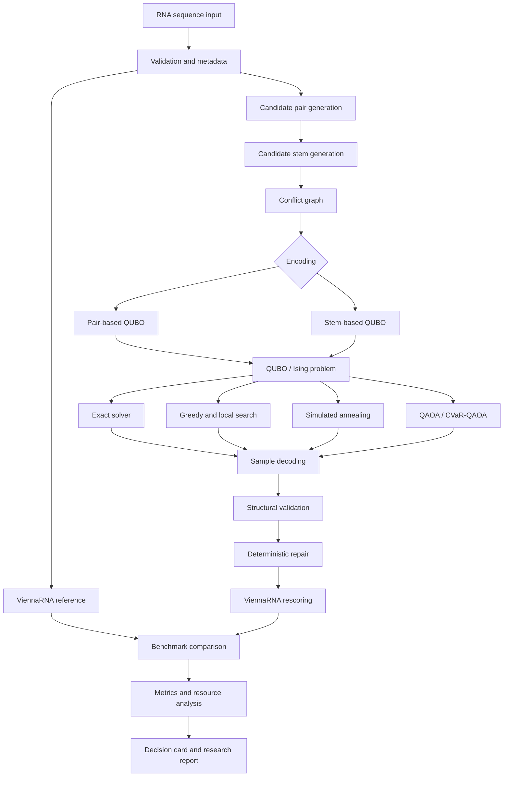

# Decidion FoldQ

## Explainable Hybrid Quantum-Classical Optimization for mRNA Secondary-Structure Prediction

> A reproducible research platform for formulating RNA secondary-structure prediction as a binary optimization problem, solving reduced instances with classical, quantum-inspired, and gate-based quantum methods, and validating every candidate against ViennaRNA.

---

## Project Status

**Status:** Research and implementation phase  
**Challenge:** WISER Summer Program 2026 — Moderna Challenge  
**Submission deadline:** August 7, 2026  
**Team:** Decidion AI  
**Primary objective:** Build and rigorously evaluate a hybrid quantum-classical approach for minimum-free-energy RNA secondary-structure prediction.

This repository is being developed as a research prototype. Features marked **Implemented** are expected to have working code, tests, and reproducible examples. Features marked **Planned** describe the intended submission architecture and should not be interpreted as completed experimental results until corresponding result files and release tags are published.

---

## Table of Contents

1. [Overview](#overview)
2. [Challenge Context](#challenge-context)
3. [Why Decidion FoldQ](#why-decidion-foldq)
4. [Research Questions](#research-questions)
5. [Project Scope](#project-scope)
6. [System Architecture](#system-architecture)
7. [End-to-End Workflow](#end-to-end-workflow)
8. [Mathematical Formulation](#mathematical-formulation)
9. [RNA Encodings](#rna-encodings)
10. [Optimization Methods](#optimization-methods)
11. [Thermodynamic Validation](#thermodynamic-validation)
12. [Benchmarking and Evaluation](#benchmarking-and-evaluation)
13. [Technology Stack](#technology-stack)
14. [Repository Structure](#repository-structure)
15. [Installation](#installation)
16. [Quick Start](#quick-start)
17. [Command-Line Interface](#command-line-interface)
18. [Python API](#python-api)
19. [Configuration](#configuration)
20. [Outputs](#outputs)
21. [Testing](#testing)
22. [Reproducibility](#reproducibility)
23. [Continuous Integration](#continuous-integration)
24. [Data and Privacy](#data-and-privacy)
25. [Experiment Plan](#experiment-plan)
26. [Research Paper Plan](#research-paper-plan)
27. [Development Roadmap](#development-roadmap)
28. [Known Limitations](#known-limitations)
29. [Future Work](#future-work)
30. [Team](#team)
31. [Contributing](#contributing)
32. [Citation](#citation)
33. [License](#license)
34. [References](#references)

---

## Overview

RNA molecules fold through intramolecular base pairing into secondary structures that can affect molecular stability, translation, degradation, accessibility, and manufacturability. Predicting the lowest-free-energy structure is a combinatorial optimization problem because the number of possible pairing arrangements grows rapidly with sequence length.

Decidion FoldQ investigates whether quantum or quantum-inspired optimization can contribute meaningfully to this problem without replacing the biological and thermodynamic strengths of established classical tools.

The platform follows a hybrid design:

1. Validate the RNA sequence.
2. Generate the ViennaRNA classical reference.
3. construct biologically plausible base-pair and stem candidates.
4. Convert the candidate-selection problem into a Quadratic Unconstrained Binary Optimization model.
5. Solve the same model with exact, classical, quantum-inspired, and quantum methods.
6. Decode sampled bit strings into RNA structures.
7. Repair and validate structural constraints.
8. Rescore candidates using ViennaRNA.
9. Compare structural accuracy, thermodynamic energy, runtime, and quantum-resource requirements.
10. Generate a transparent folding decision report.

The project is designed to answer not only whether a solver finds a low QUBO energy, but also whether:

- the biological candidate representation is sufficiently expressive;
- the QUBO objective is a credible surrogate for RNA thermodynamics;
- the optimizer reliably solves the encoded problem;
- the decoded structure competes with the classical benchmark;
- any observed benefit justifies the computational resources required.

---

## Challenge Context

The WISER Moderna Challenge asks teams to develop a quantum or quantum-inspired approach for predicting mRNA secondary structure, with emphasis on minimum-free-energy folding.

The required project components include:

- formulation of possible RNA structures as an optimization problem;
- a quantum or quantum-inspired method for identifying low-energy candidates;
- classical benchmark structures generated with ViennaRNA;
- comparison against the classical MFE result;
- analysis of scalability and practical limitations;
- reproducible source code and documentation;
- quantum-resource analysis;
- a short presentation explaining the approach, findings, and future directions.

Challenge page:

- https://www.thewiser.org/summer-program-2026/modernachallenge

Decidion FoldQ is structured so each requirement maps to a specific repository module, experiment, output, and documentation section.

| Challenge requirement | FoldQ component |
|---|---|
| Classical MFE benchmark | `foldq.classical.vienna_backend` |
| Optimization formulation | `foldq.encodings` and `foldq.qubo` |
| Quantum-inspired method | Simulated annealing through D-Wave Ocean |
| Gate-based quantum method | QAOA and optional CVaR variants through Qiskit |
| Candidate comparison | `foldq.evaluation` |
| Scaling analysis | `foldq.experiments.scaling` |
| Resource analysis | `foldq.evaluation.quantum_resources` |
| Reproducible implementation | locked environment, Docker, tests, manifests |
| Communication | decision cards, report, figures, and presentation |

---

## Why Decidion FoldQ

Many quantum optimization demonstrations stop after mapping a problem to a Hamiltonian and reporting the lowest sampled objective value. That is not sufficient for RNA folding.

A sampled binary solution can fail for several reasons:

- the candidate generator may have excluded the correct stem;
- the QUBO may reward an unphysical structure;
- penalties may be too weak or too strong;
- the solver may fail to locate the QUBO optimum;
- the decoded structure may violate RNA constraints;
- a low QUBO energy may not correspond to a low thermodynamic energy.

FoldQ separates these failure modes.

### What makes the project distinct

1. **Biologically informed compression**

   The platform compares base-pair variables with stem-level variables. Stem compression can reduce logical-variable count while retaining meaningful structural units.

2. **Common solver interface**

   Exact, greedy, annealing, and QAOA solvers receive the same QUBO and use the same decoding and evaluation pipeline.

3. **Dual-energy reporting**

   Every candidate receives both a QUBO objective value and a ViennaRNA thermodynamic energy.

4. **Raw and repaired evaluation**

   Solver outputs are evaluated before and after deterministic repair so post-processing does not conceal constraint violations.

5. **Formulation-versus-solver diagnosis**

   Exact small-instance experiments determine whether an incorrect result is caused by the mathematical formulation or the optimizer.

6. **Explainable folding decision cards**

   Each result records selected stems, rejected conflicts, constraint violations, repair operations, structural metrics, thermodynamic energy, runtime, and quantum-resource estimates.

7. **No unsupported quantum-advantage claim**

   The project measures usefulness, approximation quality, and scaling limitations. It does not assume that quantum methods outperform ViennaRNA.

---

## Research Questions

The initial study is organized around the following questions.

### RQ1: Representation

Can an RNA secondary-structure problem be encoded as a QUBO while preserving sufficient structural and energetic information to reproduce or approximate ViennaRNA MFE structures?

### RQ2: Compression

Does stem-based encoding reduce variables, interactions, and circuit resources relative to pair-based encoding without unacceptable loss of structural accuracy?

### RQ3: Optimization

Can simulated annealing or QAOA recover the exact QUBO ground state and low-energy RNA candidates more reliably than random, greedy, and local-search baselines?

### RQ4: Surrogate fidelity

How strongly does the simplified QUBO energy correlate with ViennaRNA thermodynamic energy?

### RQ5: Quantum resources

How do logical qubits, Hamiltonian terms, circuit depth, two-qubit gates, shot count, and optimizer evaluations scale with sequence and encoding size?

### RQ6: Noise and robustness

How do shot noise and hardware-inspired gate and readout errors affect valid-sample rate, energy quality, and base-pair recovery?

### RQ7: Hybrid value

Which parts of the workflow should remain classical, and where could quantum sampling contribute useful candidate diversity or difficult combinatorial search?

---

## Project Scope

### In scope for the challenge submission

- Single-stranded RNA sequences containing A, U, C, and G.
- Canonical Watson-Crick pairs and optional G-U wobble pairs.
- Pseudoknot-free structures in the primary model.
- ViennaRNA MFE and candidate-energy evaluation.
- Pair-based and stem-based binary encodings.
- Exact enumeration for small problems.
- Random, greedy, local-search, and simulated-annealing baselines.
- QAOA simulation for reduced instances.
- Optional CVaR objective and warm-start experiments.
- Structural, energy, runtime, and quantum-resource benchmarking.
- Synthetic and public non-confidential sequences.
- Reproducible command-line workflows.
- Public documentation, source code, and result manifests.

### Out of scope for the initial release

- Clinical decision making.
- Patient-specific sequence analysis.
- Proprietary Moderna sequences or confidential industrial data.
- Full tertiary-structure prediction.
- Production-grade therapeutic design.
- Complete thermodynamic representation of all RNA motifs within one compact QUBO.
- Claims of practical quantum speedup or quantum advantage.
- General pseudoknot support in the primary benchmark.
- Modified nucleotides such as pseudouridine.
- Experimental wet-lab validation during the challenge timeline.

---

## System Architecture



### Architectural layers

| Layer | Responsibility |
|---|---|
| Input and configuration | Sequence ingestion, validation, experiment settings, seeds |
| Biological representation | Pair generation, stem generation, loop constraints, conflict graph |
| Optimization formulation | Pair/stem encoding, QUBO terms, penalties, Ising mapping |
| Solver adapters | Exact, classical, annealing, QAOA, optional hardware |
| Decoding and repair | Bit-string mapping, structural validation, deterministic repair |
| Classical validation | ViennaRNA MFE, energy evaluation, ensemble references |
| Evaluation | Structural, energetic, optimization, runtime, and resource metrics |
| Reporting | Figures, tables, manifests, decision cards, manuscript outputs |

### Design principle

All solvers operate behind one interface:

```python
class FoldSolver(Protocol):
    def solve(
        self,
        problem: QuboProblem,
        config: SolverConfig,
    ) -> SolverResult:
        ...
```

This prevents solver-specific preprocessing from creating an unfair comparison.

---

## End-to-End Workflow

### 1. Sequence ingestion

The system accepts:

- direct RNA strings;
- FASTA files;
- CSV benchmark files;
- YAML experiment manifests;
- Python API objects.

Each sequence becomes a `SequenceRecord` containing:

- unique identifier;
- normalized sequence;
- length;
- GC content;
- data source;
- generation parameters;
- checksum;
- random seed;
- optional tags.

### 2. Sequence validation

Validation checks include:

- only A, U, C, and G are present;
- sequence is not empty;
- minimum and maximum lengths are respected;
- identifiers are unique;
- whitespace and line breaks are normalized;
- data provenance is recorded.

### 3. ViennaRNA reference generation

For every sequence, the classical layer can generate:

- MFE dot-bracket structure;
- MFE energy;
- base-pair list;
- partition function;
- base-pair probabilities;
- centroid structure;
- maximum expected accuracy structure;
- suboptimal structures within an energy band;
- thermodynamic energy of any submitted dot-bracket structure.

### 4. Candidate-pair generation

Candidate pairs are generated using:

- A-U and U-A compatibility;
- G-C and C-G compatibility;
- optional G-U and U-G wobble compatibility;
- configurable minimum hairpin separation;
- optional probability-guided pruning;
- optional local-context scoring.

### 5. Candidate-stem construction

Nested consecutive pairs are grouped into stems. A stem record contains:

- stem identifier;
- constituent base pairs;
- stem length;
- occupied nucleotides;
- approximate energy;
- local loop context;
- conflict list;
- optional classical prior.

### 6. Conflict-graph construction

Each candidate stem is a graph node. Edges identify pairs of stems that cannot coexist because of:

- nucleotide reuse;
- alternative pairing of the same nucleotide;
- prohibited crossing;
- incompatible nesting;
- invalid loop geometry;
- other encoding-specific constraints.

### 7. QUBO construction

The QUBO builder creates:

- linear coefficients;
- quadratic coefficients;
- constant offset;
- variable-to-structure mapping;
- normalized penalty configuration;
- coefficient diagnostics;
- graph and matrix density;
- Ising Hamiltonian representation.

### 8. Optimization

The same QUBO can be solved with:

- exact enumeration;
- random sampling;
- greedy selection;
- hill climbing;
- tabu search;
- simulated annealing;
- optional D-Wave QPU or hybrid solver;
- QAOA;
- optional CVaR-QAOA;
- optional warm-start QAOA.

### 9. Decoding

Binary samples are translated into:

- selected stems;
- selected base pairs;
- raw dot-bracket notation;
- structural validation report;
- repaired dot-bracket notation;
- repair history.

### 10. Thermodynamic rescoring

Each candidate is evaluated using ViennaRNA. This produces:

- candidate free energy;
- energy gap from MFE;
- energy before and after repair;
- rank among generated candidates;
- agreement between QUBO ranking and thermodynamic ranking.

### 11. Evaluation and reporting

The pipeline exports:

- benchmark tables;
- structural metrics;
- runtime metrics;
- resource estimates;
- scaling plots;
- raw solver samples;
- experiment manifests;
- human-readable decision cards.

---

## Mathematical Formulation

### Binary variables

For a stem-based encoding, define:

\[
x_s =
\begin{cases}
1, & \text{if candidate stem } s \text{ is selected}, \\
0, & \text{otherwise}.
\end{cases}
\]

The optimization problem minimizes:

\[
H(\mathbf{x}) =
H_{\text{structure}}(\mathbf{x})
+
H_{\text{constraints}}(\mathbf{x})
+
H_{\text{regularization}}(\mathbf{x}).
\]

A first-order stem QUBO can be written as:

\[
H(\mathbf{x}) =
\sum_s E_s x_s
+
\lambda_{\text{overlap}}
\sum_{(s,t)\in C_{\text{overlap}}} x_sx_t
+
\lambda_{\text{cross}}
\sum_{(s,t)\in C_{\text{cross}}} x_sx_t
+
\lambda_{\text{loop}}P_{\text{loop}}(\mathbf{x})
+
\lambda_{\text{fragment}}P_{\text{fragment}}(\mathbf{x}).
\]

Where:

- \(E_s\) approximates the energetic contribution of stem \(s\);
- \(C_{\text{overlap}}\) contains stem pairs that reuse nucleotides;
- \(C_{\text{cross}}\) contains incompatible crossing stems;
- \(P_{\text{loop}}\) penalizes invalid or highly unfavorable loop arrangements;
- \(P_{\text{fragment}}\) discourages excessive isolated or fragmented pairing.

### QUBO representation

The binary objective is represented as:

\[
f(\mathbf{x}) =
\sum_i Q_{ii}x_i +
\sum_{i<j}Q_{ij}x_ix_j.
\]

The implementation stores this as a binary quadratic model and preserves a complete variable map from each binary index to its biological meaning.

### QUBO-to-Ising mapping

For gate-based algorithms, binary variables are mapped to spin variables:

\[
x_i = \frac{1-z_i}{2}, \qquad z_i \in \{-1,+1\}.
\]

The resulting Ising objective is:

\[
H_{\text{Ising}} =
\sum_i h_i Z_i +
\sum_{i<j}J_{ij}Z_iZ_j +
c.
\]

The corresponding cost operator is represented using Qiskit `SparsePauliOp`.

### Penalty calibration

Penalty coefficients are calibrated through:

1. analytical lower bounds;
2. normalized coefficient scaling;
3. grid search;
4. optional Bayesian optimization;
5. sensitivity analysis across sequences;
6. validation against exact small-instance solutions.

A hard-constraint penalty should be large enough that no energetic reward from an invalid structure compensates for the violation. However, excessively large penalties can widen coefficient ranges, worsen conditioning, and reduce performance on noisy or analog hardware.

The repository therefore records:

- raw energy scale;
- penalty scale;
- coefficient range;
- condition ratio;
- constraint-violation rate;
- sensitivity of the solution to small penalty changes.

---

## RNA Encodings

### Pair-based encoding

Each valid candidate base pair receives one binary variable.

#### Advantages

- maximum local flexibility;
- simple biological interpretation;
- less dependence on candidate-stem construction;
- potential to recover structures that use unusual stem lengths.

#### Limitations

- variable count can grow approximately quadratically with sequence length;
- many overlap constraints are required;
- QUBO density can become large;
- isolated and fragmented pair selections are common;
- circuit and embedding resources grow rapidly.

### Stem-based encoding

Each candidate stem receives one binary variable.

#### Advantages

- fewer variables;
- structurally meaningful decisions;
- fewer isolated pairs;
- lower expected QUBO density;
- potentially smaller quantum circuits.

#### Limitations

- candidate-generator bias;
- correct structures may be excluded;
- fixed stem boundaries reduce flexibility;
- overlapping stem variants may still produce many variables.

### Hierarchical encoding

A planned advanced representation combines:

- stem activation variables;
- optional pair-refinement variables;
- local loop or motif variables;
- decomposition variables for sequence windows.

The goal is to preserve coarse structural compression while permitting local corrections.

### Encoding diagnostics

Every encoded instance reports:

- sequence length;
- number of candidate pairs;
- number of candidate stems;
- number of binary variables;
- number of linear terms;
- number of quadratic terms;
- QUBO density;
- maximum conflict-graph degree;
- number of excluded candidate pairs;
- whether the ViennaRNA MFE structure remains representable.

The last metric is critical: a solver cannot recover the MFE structure if the encoding removed one of its required stems.

---

## Optimization Methods

### Exact solver

Used for small instances to determine:

- exact QUBO ground energy;
- ground-state bit strings;
- degeneracy;
- energy gap;
- whether the QUBO optimum is structurally valid;
- whether heuristic and quantum methods locate the true optimum.

### Random baseline

Provides a minimum baseline for:

- energy quality;
- valid-sample rate;
- structural accuracy;
- candidate diversity.

### Greedy baseline

Selects stable, non-conflicting stems using configurable ranking rules.

Possible rankings include:

- approximate stem energy;
- energy per base pair;
- stem length;
- conflict-adjusted score;
- classical probability prior.

### Local search

Possible local moves include:

- add a stem;
- remove a stem;
- replace one stem with another;
- swap conflicting stems;
- repair one violation at a time.

### Simulated annealing

The primary quantum-inspired method uses D-Wave Ocean samplers.

Configurable parameters include:

- number of reads;
- number of sweeps;
- beta range;
- beta schedule;
- initial state;
- random seed;
- post-processing;
- sample aggregation.

### Quantum annealing

Optional experiments can use D-Wave hardware or hybrid services when access is available.

Hardware-specific metrics include:

- embedding size;
- physical qubits;
- chain length;
- chain strength;
- broken-chain fraction;
- QPU sampling time;
- total access time.

### QAOA

The gate-based implementation follows:

1. QUBO-to-Ising conversion.
2. Cost Hamiltonian construction.
3. Mixer Hamiltonian construction.
4. Parameterized circuit generation.
5. Classical parameter optimization.
6. Statevector or shot-based execution.
7. Bit-string sampling.
8. Decoding and rescoring.

Planned comparisons include:

- depth \(p=1,2,3\), where feasible;
- random initialization;
- transferred parameters;
- warm-start initialization;
- standard X mixer;
- constraint-aware mixer;
- COBYLA;
- SPSA;
- Nelder-Mead;
- expectation-value objective;
- CVaR objective;
- noiseless and noisy execution.

### CVaR objective

Instead of averaging over all measured energies, Conditional Value at Risk focuses optimization on a selected low-energy tail of the sampled distribution.

A configurable \(\alpha\) determines the fraction of low-energy samples included in the objective.

### Noise models

Planned noise experiments include:

- finite-shot sampling;
- readout error;
- single-qubit depolarizing error;
- two-qubit depolarizing error;
- device-inspired coupling maps;
- transpilation overhead.

---

## Thermodynamic Validation

The QUBO is treated as a search surrogate, not as a complete replacement for the ViennaRNA energy model.

For each candidate, the pipeline records:

| Field | Meaning |
|---|---|
| `qubo_energy_raw` | Solver-reported objective before repair |
| `qubo_energy_repaired` | QUBO objective after repair |
| `vienna_energy_raw` | ViennaRNA energy of raw valid candidate |
| `vienna_energy_repaired` | ViennaRNA energy after repair |
| `mfe_energy` | ViennaRNA reference MFE |
| `absolute_energy_gap` | Candidate energy minus MFE energy |
| `relative_energy_gap` | Energy gap normalized by reference magnitude |
| `qubo_rank` | Rank by optimization objective |
| `vienna_rank` | Rank by thermodynamic energy |

### Benchmark modes

#### Independent mode

ViennaRNA is used only after optimization for benchmarking and rescoring.

#### Probability-guided mode

ViennaRNA base-pair probabilities may be used to prune candidate pairs. Results must be labelled as classically guided.

#### Warm-start mode

A classical candidate or probability distribution initializes the quantum or annealing solver.

#### Ensemble mode

Candidates are compared with MFE, centroid, maximum-expected-accuracy, and suboptimal structures rather than only one fold.

---

## Benchmarking and Evaluation

### Benchmark tiers

#### Tier 1: Formulation verification

- approximate sequence length: 8–14 nt;
- exact enumeration feasible;
- penalty and encoding validation;
- ground-state analysis.

#### Tier 2: Gate-based simulation

- approximate sequence length: 12–30 nt;
- reduced stem encoding;
- QAOA, CVaR, shot, and noise studies.

#### Tier 3: Quantum-inspired optimization

- approximate sequence length: 25–100 nt;
- simulated annealing and local-search comparisons;
- QUBO scaling analysis.

#### Tier 4: Stress tests

- approximate sequence length: 100–500 nt;
- candidate generation and graph complexity;
- pruning and decomposition;
- projected quantum resources rather than direct QAOA execution.

These ranges are initial targets, not guarantees. The actual feasible range depends more directly on the number of retained variables and interactions than on nucleotide length alone.

### Controlled sequence characteristics

Synthetic benchmark sets vary:

- sequence length;
- GC content;
- wobble-pair allowance;
- candidate-pair count;
- candidate-stem count;
- stem-length distribution;
- conflict-graph density;
- MFE base-pair density;
- number of low-energy alternatives;
- MFE energy gap;
- motif repetition.

### Structural metrics

- exact dot-bracket match;
- base-pair precision;
- base-pair recall;
- base-pair F1 score;
- base-pair distance;
- stem precision;
- stem recall;
- stem F1 score;
- invalid overlap count;
- crossing count;
- repair count;
- valid-sample rate.

### Energy metrics

- best ViennaRNA-rescored energy;
- mean and median candidate energy;
- absolute and relative MFE gap;
- QUBO–Vienna energy correlation;
- top-1, top-5, and top-10 MFE recovery;
- probability of sampling the exact QUBO ground state;
- probability of sampling the ViennaRNA MFE structure.

### Optimization metrics

- best objective value;
- mean sampled objective;
- ground-state hit rate;
- unique valid candidates;
- sampling entropy;
- optimizer iterations;
- objective evaluations;
- seed sensitivity;
- penalty sensitivity.

### Runtime metrics

- sequence validation time;
- candidate generation time;
- conflict-graph time;
- QUBO-construction time;
- solver time;
- decoding time;
- repair time;
- ViennaRNA-rescoring time;
- end-to-end runtime;
- peak memory usage.

### Quantum-resource metrics

- logical qubits;
- Hamiltonian terms;
- QUBO density;
- circuit depth;
- transpiled depth;
- one-qubit gates;
- two-qubit gates;
- SWAP gates;
- shots;
- optimizer iterations;
- circuit evaluations;
- estimated physical qubits;
- optional annealing embedding overhead.

### Statistical analysis

Stochastic experiments should be repeated over multiple random seeds.

Recommended reporting:

- median;
- interquartile range;
- bootstrap confidence intervals;
- success probability;
- effect size;
- paired comparisons when runs share the same sequence;
- failure-case analysis rather than only aggregate means.

### Required ablations

1. Pair versus stem encoding.
2. Canonical pairs versus canonical plus wobble pairs.
3. Fixed versus adaptive penalties.
4. QUBO ranking versus ViennaRNA rescoring.
5. Raw versus repaired candidates.
6. Full candidate set versus pruned candidate set.
7. Cold-start versus warm-start QAOA.
8. Expectation versus CVaR objective.
9. Noiseless versus shot-based execution.
10. Noiseless versus hardware-inspired noise.
11. Monolithic versus decomposed QUBO.
12. Minimum stem length sensitivity.
13. QAOA depth sensitivity.

---

## Technology Stack

The dependency lockfile is the authoritative source for exact package versions. The following stack describes the target architecture.

### Core

| Technology | Purpose |
|---|---|
| Python 3.11 | Primary implementation language |
| `pyproject.toml` | Package and build configuration |
| `uv` or `pip` | Environment and dependency installation |
| Conda/micromamba | Optional cross-platform ViennaRNA environment |
| Docker | Reproducible Linux execution |

### RNA and bioinformatics

| Package | Purpose |
|---|---|
| ViennaRNA | MFE prediction, energy evaluation, partition functions |
| Biopython | FASTA parsing and sequence utilities |
| NetworkX | Stem conflict graphs and decomposition |
| forgi | Optional RNA graph representation |
| forna | Optional interactive RNA visualization |

### Numerical and optimization

| Package | Purpose |
|---|---|
| NumPy | Arrays and numerical calculations |
| SciPy | Optimization, statistics, sparse structures |
| pandas | Benchmark tables and result aggregation |
| `dimod` | Binary quadratic models |
| D-Wave Ocean SDK | Simulated annealing and optional quantum annealing |
| Optuna | Penalty and hyperparameter search |
| HiGHS through SciPy | Optional classical exact or mixed-integer baseline |

### Quantum

| Package | Purpose |
|---|---|
| Qiskit | Circuits, operators, primitives, transpilation |
| qiskit-addon-opt-mapper | Optimization-model mapping utilities |
| Qiskit Aer or equivalent local primitives | Statevector, shot-based, and noisy simulation |
| qiskit-ibm-runtime | Optional IBM Quantum execution |
| `SparsePauliOp` | Ising cost-Hamiltonian representation |

### Quality and testing

| Package | Purpose |
|---|---|
| pytest | Unit and integration tests |
| pytest-cov | Coverage reporting |
| Hypothesis | Property-based tests |
| Ruff | Formatting and linting |
| mypy | Static type checking |
| pre-commit | Local quality checks |

### Reporting and documentation

| Package | Purpose |
|---|---|
| Matplotlib | Static publication figures |
| Plotly | Optional interactive diagnostics |
| Jinja2 | HTML decision-card generation |
| MkDocs Material | Technical documentation |
| Quarto or Jupyter Book | Research report and supplementary analysis |

### Current reference versions at project planning time

The following versions were current in July 2026 and may be used as the starting point for a compatibility lock:

- Qiskit 2.5.0
- qiskit-addon-opt-mapper 0.1.0
- D-Wave Ocean SDK 9.4.0
- ViennaRNA 2.7.x

Do not rely on this section alone for reproduction. Use the committed lockfile and release manifest.

---

## Repository Structure

```text
decidion-foldq/
│
├── README.md
├── LICENSE
├── CITATION.cff
├── CONTRIBUTING.md
├── CODE_OF_CONDUCT.md
├── SECURITY.md
├── CHANGELOG.md
├── pyproject.toml
├── uv.lock
├── environment.yml
├── Dockerfile
├── docker-compose.yml
├── Makefile
├── .env.example
├── .gitignore
├── .pre-commit-config.yaml
│
├── .github/
│   ├── workflows/
│   │   ├── lint.yml
│   │   ├── tests.yml
│   │   ├── integration.yml
│   │   ├── docker.yml
│   │   └── reproduce.yml
│   ├── ISSUE_TEMPLATE/
│   ├── pull_request_template.md
│   ├── CODEOWNERS
│   └── dependabot.yml
│
├── configs/
│   ├── base.yaml
│   ├── exact.yaml
│   ├── greedy.yaml
│   ├── simulated_annealing.yaml
│   ├── qaoa_statevector.yaml
│   ├── qaoa_shot_based.yaml
│   ├── qaoa_noise.yaml
│   ├── cvar_qaoa.yaml
│   ├── pair_encoding.yaml
│   ├── stem_encoding.yaml
│   ├── penalty_search.yaml
│   └── scaling_study.yaml
│
├── data/
│   ├── raw/
│   │   ├── synthetic/
│   │   └── public/
│   ├── processed/
│   ├── benchmark_sets/
│   ├── manifests/
│   └── README.md
│
├── src/
│   └── foldq/
│       ├── __init__.py
│       ├── cli.py
│       ├── pipeline.py
│       ├── config.py
│       ├── constants.py
│       │
│       ├── schemas/
│       ├── io/
│       ├── biology/
│       ├── classical/
│       ├── encodings/
│       ├── qubo/
│       ├── solvers/
│       ├── decoding/
│       ├── evaluation/
│       ├── experiments/
│       ├── visualization/
│       └── reporting/
│
├── scripts/
│   ├── generate_synthetic_data.py
│   ├── build_reference_dataset.py
│   ├── validate_qubo.py
│   ├── run_classical_baselines.py
│   ├── run_annealing.py
│   ├── run_qaoa.py
│   ├── run_ablation_study.py
│   ├── run_scaling_study.py
│   └── build_final_report.py
│
├── notebooks/
│   ├── 01_viennarna_reference.ipynb
│   ├── 02_candidate_generation.ipynb
│   ├── 03_qubo_validation.ipynb
│   ├── 04_annealing_benchmark.ipynb
│   ├── 05_qaoa_benchmark.ipynb
│   ├── 06_noise_analysis.ipynb
│   └── 07_scalability_analysis.ipynb
│
├── tests/
│   ├── unit/
│   ├── property/
│   ├── integration/
│   ├── regression/
│   ├── scientific/
│   └── fixtures/
│
├── results/
│   ├── raw/
│   ├── processed/
│   ├── metrics/
│   ├── figures/
│   ├── tables/
│   ├── decision_cards/
│   └── manifests/
│
├── docs/
│   ├── index.md
│   ├── architecture.md
│   ├── mathematical_formulation.md
│   ├── thermodynamic_model.md
│   ├── solver_methods.md
│   ├── benchmarking.md
│   ├── reproducibility.md
│   ├── limitations.md
│   └── api_reference.md
│
├── paper/
│   ├── manuscript.tex
│   ├── references.bib
│   ├── figures/
│   ├── tables/
│   └── supplementary_information.tex
│
└── presentation/
    ├── slides.pptx
    ├── slides.pdf
    ├── speaker_notes.md
    └── demo_script.md
```

---

## Installation

### System requirements

Recommended development environment:

- Python 3.11;
- Git;
- 8 GB RAM minimum;
- 16 GB or more recommended for simulation;
- C/C++ build tools if installing packages from source;
- optional Docker;
- optional IBM Quantum or D-Wave account for hardware experiments.

### Clone the repository

```bash
git clone <repository-url>
cd decidion-foldq
```

### Option A: `uv` installation

```bash
uv venv --python 3.11
```

Activate the environment:

```bash
# Linux or macOS
source .venv/bin/activate

# Windows PowerShell
.venv\Scripts\Activate.ps1
```

Install the base project:

```bash
uv sync
```

Install development and quantum extras:

```bash
uv sync --extra dev --extra quantum
```

### Option B: standard virtual environment

```bash
python -m venv .venv
```

Activate it and install:

```bash
python -m pip install --upgrade pip
pip install -e ".[dev,quantum]"
```

### Option C: Conda or micromamba

```bash
micromamba create -n foldq -f environment.yml
micromamba activate foldq
pip install -e ".[dev,quantum]"
```

### Option D: Docker

```bash
docker build -t decidion-foldq:latest .
```

Run the demonstration:

```bash
docker run --rm \
  -v "${PWD}/results:/app/results" \
  decidion-foldq:latest \
  foldq predict \
  --sequence GGGAAAUCCCU \
  --solver simulated-annealing \
  --output results/docker-demo
```

### Verify the installation

```bash
foldq doctor
```

Expected checks:

- Python version;
- ViennaRNA import;
- Qiskit import;
- D-Wave Ocean import;
- optional IBM credentials;
- optional D-Wave credentials;
- writable result directory.

Run tests:

```bash
pytest -q
```

---

## Quick Start

### Predict with simulated annealing

```bash
foldq predict \
  --sequence GGGAAAUCCCU \
  --encoding stem \
  --solver simulated-annealing \
  --config configs/base.yaml \
  --output results/demo
```

### Run an exact small-instance analysis

```bash
foldq predict \
  --sequence GGGAAAUCCCU \
  --encoding stem \
  --solver exact \
  --config configs/exact.yaml \
  --output results/exact-demo
```

### Run QAOA simulation

```bash
foldq predict \
  --sequence GGGAAAUCCCU \
  --encoding stem \
  --solver qaoa \
  --config configs/qaoa_statevector.yaml \
  --output results/qaoa-demo
```

### Compare multiple solvers

```bash
foldq benchmark \
  --dataset data/benchmark_sets/tier1.csv \
  --solvers exact,greedy,simulated-annealing,qaoa \
  --encodings pair,stem \
  --output results/tier1-comparison
```

### Run the primary reproducibility target

```bash
make reproduce
```

---

## Command-Line Interface

### General help

```bash
foldq --help
```

### Validate a sequence

```bash
foldq validate --sequence AUGGCUAACGCU
```

### Generate synthetic sequences

```bash
foldq generate \
  --count 100 \
  --lengths 12,16,20,24,30 \
  --gc-range 0.30,0.70 \
  --seed 42 \
  --output data/raw/synthetic/tier1.csv
```

### Build ViennaRNA references

```bash
foldq reference \
  --input data/raw/synthetic/tier1.csv \
  --partition-function \
  --suboptimal-band 2.0 \
  --output data/processed/tier1_reference.parquet
```

### Inspect candidate stems

```bash
foldq candidates \
  --sequence GGGAAAUCCCU \
  --minimum-hairpin 3 \
  --minimum-stem-length 2 \
  --allow-wobble \
  --output results/candidate-inspection
```

### Export a QUBO

```bash
foldq build-qubo \
  --sequence GGGAAAUCCCU \
  --encoding stem \
  --config configs/stem_encoding.yaml \
  --format json \
  --output results/qubo-demo
```

### Run a scaling study

```bash
foldq scale \
  --dataset data/benchmark_sets/scaling.csv \
  --encodings pair,stem \
  --max-qaoa-variables 24 \
  --output results/scaling-study
```

### Generate a decision card

```bash
foldq report \
  --manifest results/demo/manifest.json \
  --format html \
  --output results/demo/decision-card.html
```

---

## Python API

```python
from foldq.pipeline import FoldQPipeline
from foldq.schemas.sequence import SequenceRecord
from foldq.config import load_config

config = load_config("configs/base.yaml")

record = SequenceRecord(
    sequence_id="demo_001",
    sequence="GGGAAAUCCCU",
    source_type="synthetic",
    random_seed=42,
)

pipeline = FoldQPipeline(config=config)

result = pipeline.predict(
    record=record,
    encoding="stem",
    solver="simulated-annealing",
)

print("ViennaRNA MFE:", result.reference.dot_bracket)
print("FoldQ candidate:", result.best_candidate.dot_bracket)
print("Energy gap:", result.best_candidate.energy_gap)
print("Base-pair F1:", result.best_candidate.metrics.base_pair_f1)
```

### Build only the encoded problem

```python
from foldq.biology.stems import generate_candidate_stems
from foldq.biology.conflicts import build_conflict_graph
from foldq.encodings.stem_encoding import StemEncoding

sequence = "GGGAAAUCCCU"

stems = generate_candidate_stems(
    sequence,
    minimum_stem_length=2,
    allow_wobble=True,
)

graph = build_conflict_graph(stems)

encoding = StemEncoding()
problem = encoding.build(
    sequence=sequence,
    stems=stems,
    conflict_graph=graph,
)
```

### Solve an existing QUBO

```python
from foldq.solvers.simulated_annealing import SimulatedAnnealingSolver

solver = SimulatedAnnealingSolver(
    num_reads=1_000,
    num_sweeps=10_000,
    seed=42,
)

solver_result = solver.solve(problem)
```

---

## Configuration

Experiments are controlled through YAML so every reported result can be reproduced.

Example:

```yaml
experiment:
  name: tier1_stem_sa
  seed: 42
  output_dir: results/tier1_stem_sa

sequence:
  allow_wobble: true
  minimum_hairpin_distance: 3
  temperature_celsius: 37.0

candidate_generation:
  encoding: stem
  minimum_stem_length: 2
  maximum_stem_length: null
  probability_pruning:
    enabled: false
    minimum_probability: 0.01

qubo:
  energy_model: approximate_stacking_v1
  normalize_coefficients: true
  penalties:
    overlap: adaptive
    crossing: adaptive
    loop: 2.0
    fragmentation: 0.5

solver:
  name: simulated_annealing
  num_reads: 1000
  num_sweeps: 10000
  beta_range: auto

decoding:
  repair_invalid: true
  repair_strategy: marginal_energy

evaluation:
  use_vienna_rescoring: true
  calculate_partition_function: true
  calculate_suboptimal: false
  top_k: 10

reporting:
  save_raw_samples: true
  save_qubo: true
  save_figures: true
  generate_decision_card: true
```

### Configuration precedence

1. package defaults;
2. YAML configuration;
3. environment variables;
4. command-line arguments.

All resolved settings are written into the experiment manifest.

---

## Outputs

A typical experiment directory contains:

```text
results/demo/
├── manifest.json
├── resolved_config.yaml
├── sequence.json
├── vienna_reference.json
├── candidates.json
├── conflict_graph.graphml
├── qubo.json
├── ising_hamiltonian.json
├── raw_samples.parquet
├── decoded_candidates.parquet
├── benchmark_metrics.json
├── resource_metrics.json
├── runtime_metrics.json
├── decision-card.html
├── summary.md
└── figures/
    ├── structure_comparison.svg
    ├── selected_stems.svg
    ├── energy_distribution.png
    ├── conflict_graph.png
    └── circuit_resources.png
```

### Folding decision card

Each decision card should include:

- input sequence;
- sequence metadata;
- ViennaRNA MFE;
- FoldQ candidate;
- structural overlay;
- correct, missing, and additional base pairs;
- selected stems;
- rejected conflicts;
- QUBO energy;
- ViennaRNA energy;
- energy gap;
- repair operations;
- solver configuration;
- runtime;
- logical-variable count;
- circuit or annealing resources;
- sampling-based confidence;
- limitations.

---

## Testing

### Unit tests

Unit tests cover:

- sequence validation;
- base-pair compatibility;
- hairpin-distance rules;
- stem extraction;
- conflict detection;
- dot-bracket conversion;
- QUBO coefficient construction;
- QUBO-to-Ising mapping;
- sample decoding;
- repair operations;
- structural metrics;
- runtime and resource collection.

Run:

```bash
pytest tests/unit -q
```

### Property-based tests

Property tests verify invariants over randomly generated sequences:

- dot-bracket length equals sequence length;
- brackets are balanced;
- no nucleotide has more than one partner;
- every selected stem maps to its expected pairs;
- hard-constraint violations increase objective energy;
- same seed produces the same deterministic output.

Run:

```bash
pytest tests/property -q
```

### Scientific validation tests

Scientific tests verify:

- exact enumeration matches stored reference solutions;
- the MFE structure is representable when expected;
- ViennaRNA energies match known fixtures within tolerance;
- penalty changes have the expected effect;
- QUBO and Ising evaluations agree after accounting for offset.

Run:

```bash
pytest tests/scientific -q
```

### Integration tests

Integration tests execute:

```text
sequence
→ reference
→ candidates
→ QUBO
→ solver
→ decode
→ repair
→ ViennaRNA rescore
→ metrics
→ report
```

Run:

```bash
pytest tests/integration -q
```

### Regression tests

Fixed sequences and result checksums are used to detect silent changes in scientific behavior.

```bash
pytest tests/regression -q
```

### Coverage

```bash
pytest --cov=foldq --cov-report=term-missing
```

Target coverage:

- at least 90% for deterministic core modules;
- at least 80% overall;
- all mathematical formulation and decoding functions covered.

---

## Reproducibility

Every experiment manifest records:

- Git commit;
- release version;
- operating system;
- Python version;
- package versions;
- input checksum;
- configuration checksum;
- random seeds;
- solver settings;
- QUBO coefficients;
- raw samples;
- runtime metadata;
- hardware backend, when used;
- transpilation seed;
- output checksums.

### Reproduce the main benchmark

```bash
make reproduce
```

### Reproduce one experiment

```bash
foldq reproduce --manifest results/example/manifest.json
```

### Container reproduction

```bash
docker pull <container-registry>/decidion-foldq:v1.0.0
docker run --rm \
  -v "${PWD}/reproduced:/app/results" \
  <container-registry>/decidion-foldq:v1.0.0 \
  foldq reproduce \
  --manifest examples/submission_manifest.json
```

### Release archiving

The final submission release should include:

- GitHub release tag;
- source archive;
- lockfile;
- Docker image digest;
- result checksums;
- Zenodo DOI, if available;
- presentation;
- manuscript or technical report.

---

## Continuous Integration

Planned GitHub Actions workflows:

### `lint.yml`

- Ruff formatting;
- Ruff linting;
- Markdown linting;
- import checks.

### `tests.yml`

- Python test matrix;
- unit tests;
- type checks;
- coverage upload.

### `integration.yml`

- install ViennaRNA;
- run a small complete pipeline;
- verify expected output files.

### `reproduce.yml`

- create a clean environment;
- run the small public benchmark;
- regenerate tables;
- compare checksums.

### `docker.yml`

- build container;
- run tests inside the image;
- publish tagged images after release.

### Pull-request requirements

Each pull request should state:

1. scientific or engineering purpose;
2. effect on the mathematical formulation;
3. effect on benchmark outputs;
4. tests added;
5. reproducibility impact;
6. documentation changes.

---

## Data and Privacy

Only the following data are permitted:

- synthetic RNA sequences;
- randomly generated RNA sequences;
- public benchmark sequences;
- public experimentally characterized structures where licensing permits.

The project must not use:

- confidential Moderna data;
- patient or clinical data;
- proprietary therapeutic sequences;
- personally identifiable information;
- restricted datasets without redistribution permission.

### Data manifest

Every dataset should include:

- source;
- license;
- retrieval or generation date;
- checksum;
- processing steps;
- allowed uses;
- sequence identifiers;
- whether redistribution is permitted.

### Secrets

Do not commit:

- IBM Quantum tokens;
- D-Wave API tokens;
- private keys;
- `.env` files;
- proprietary datasets.

Use `.env.example` for variable names only.

---

## Experiment Plan

### Experiment 1: QUBO correctness

Purpose:

- verify coefficient construction;
- distinguish formulation error from solver error;
- measure exact ground-state agreement.

Methods:

- short sequences;
- exact enumeration;
- pair and stem encodings;
- systematic penalty sweeps.

### Experiment 2: Encoding comparison

Compare:

- candidate count;
- variable count;
- QUBO density;
- MFE representability;
- structural F1;
- energy gap;
- runtime.

### Experiment 3: Solver comparison

Compare:

- random;
- greedy;
- local search;
- exact;
- simulated annealing;
- QAOA.

Use the same encoded problem and evaluation procedure.

### Experiment 4: Penalty sensitivity

Vary:

- overlap penalty;
- crossing penalty;
- fragmentation penalty;
- loop penalty;
- coefficient normalization.

Measure:

- valid-sample rate;
- QUBO ground state;
- ViennaRNA energy;
- robustness.

### Experiment 5: QAOA depth and initialization

Compare:

- \(p=1,2,3\);
- random initialization;
- transferred parameters;
- warm start;
- multiple optimizers.

### Experiment 6: CVaR study

Compare:

- expectation objective;
- several CVaR \(\alpha\) values;
- best-sample quality;
- sampling diversity;
- optimizer stability.

### Experiment 7: Noise study

Introduce:

- finite shots;
- readout error;
- single-qubit error;
- two-qubit error;
- transpilation overhead.

### Experiment 8: Scaling study

Measure versus sequence length and variable count:

- candidate generation;
- conflict graph;
- QUBO size;
- logical qubits;
- circuit depth;
- solver runtime;
- structural accuracy;
- energy quality.

### Experiment 9: Graph decomposition

Compare:

- monolithic QUBO;
- community-based decomposition;
- overlapping windows;
- local solutions plus master reconciliation.

### Experiment 10: Failure analysis

Manually inspect cases where:

- MFE is not representable;
- QUBO optimum differs from MFE;
- solver misses QUBO optimum;
- repair substantially changes the result;
- QUBO and Vienna energy rankings disagree.

---

## Research Paper Plan

### Working title

**Stem-Compressed QUBO Encodings for Explainable Hybrid Quantum-Classical RNA Secondary-Structure Prediction**

### Proposed contributions

1. A modular pair- and stem-based RNA QUBO framework.
2. Exact small-instance separation of formulation and solver error.
3. Hybrid ViennaRNA rescoring with raw-versus-repaired reporting.
4. Common benchmarking of exact, classical, annealing, and QAOA solvers.
5. Detailed logical-qubit, circuit, runtime, and scaling analysis.
6. An explainable folding decision-card framework.
7. A fully reproducible public codebase and benchmark suite.

### Manuscript outline

#### 1. Introduction

- importance of RNA secondary structure;
- combinatorial complexity;
- strengths of classical thermodynamic methods;
- motivation for quantum optimization;
- research gap;
- project contributions.

#### 2. Related work

- ViennaRNA and MFE prediction;
- RNA QUBO formulations;
- quantum annealing approaches;
- gate-based QAOA approaches;
- CVaR-based mRNA optimization;
- quantum-centric longer-sequence workflows.

#### 3. Mathematical formulation

- candidate pairs;
- candidate stems;
- conflict graph;
- pair QUBO;
- stem QUBO;
- penalties;
- Ising conversion;
- complexity.

#### 4. Methods

- datasets;
- ViennaRNA references;
- solvers;
- QAOA circuits;
- noise models;
- metrics;
- statistical analysis;
- reproducibility.

#### 5. Experiments

- exact formulation validation;
- pair-versus-stem encoding;
- solver comparison;
- penalty ablation;
- depth and initialization;
- CVaR;
- noise;
- scaling;
- decomposition.

#### 6. Results

Planned primary figures:

1. system architecture;
2. example stem conflict graph;
3. pair-versus-stem variable growth;
4. QUBO density versus sequence length;
5. structural F1 by solver;
6. ViennaRNA energy gap by solver;
7. QUBO–Vienna energy correlation;
8. valid-sample rate;
9. QAOA depth and noise sensitivity;
10. qubit and gate scaling.

Planned primary tables:

1. benchmark characteristics;
2. encoding statistics;
3. solver configurations;
4. structural and energetic performance;
5. resource requirements;
6. ablation results;
7. failure cases.

#### 7. Discussion

- value and limitations of compression;
- dependence on candidate generation;
- difference between solving the QUBO and solving RNA folding;
- role of classical rescoring;
- near-term usefulness of quantum sampling;
- hardware requirements.

#### 8. Limitations

- approximate energy objective;
- restricted quantum instance size;
- limited circuit depth;
- classical preprocessing dependence;
- limited pseudoknot support;
- no quantum-advantage claim.

#### 9. Reproducibility statement

- repository;
- lockfile;
- Docker image;
- datasets;
- raw samples;
- configuration files;
- checksums;
- scripts;
- archived release.

### Paper directory

```text
paper/
├── manuscript.tex
├── references.bib
├── supplementary_information.tex
├── figures/
├── tables/
└── response_to_reviewers/
```

---

## Development Roadmap

### Phase 1: Foundation

- repository setup;
- environment lock;
- sequence schemas;
- validation;
- ViennaRNA wrapper;
- synthetic dataset generation;
- test infrastructure.

### Phase 2: Biological representation

- candidate pairs;
- candidate stems;
- loop rules;
- conflict graph;
- dot-bracket utilities;
- MFE representability analysis.

### Phase 3: QUBO formulation

- pair encoding;
- stem encoding;
- penalty terms;
- coefficient normalization;
- Ising mapping;
- exact validation.

### Phase 4: Solver layer

- random;
- greedy;
- local search;
- exact;
- simulated annealing;
- common result schema.

### Phase 5: Quantum implementation

- QAOA;
- multiple depths;
- optimizer comparison;
- CVaR;
- warm start;
- shot-based simulation;
- noise models.

### Phase 6: Benchmarking

- encoding ablation;
- penalty calibration;
- solver comparison;
- scaling analysis;
- resource analysis;
- failure-case review.

### Phase 7: Submission

- final figures;
- decision cards;
- README;
- technical report;
- clean reproduction;
- presentation;
- tagged release.

### Challenge timeline

| Date | Target |
|---|---|
| July 22–24, 2026 | Environment, schemas, ViennaRNA, dataset |
| July 25–27, 2026 | Candidate generation, conflicts, QUBO |
| July 28–30, 2026 | Classical and annealing pipeline |
| July 31–August 2, 2026 | QAOA, CVaR, noise, resources |
| August 3–4, 2026 | Benchmarks and scaling |
| August 5, 2026 | Figures, report, decision cards |
| August 6, 2026 | Clean reproduction and presentation |
| August 7, 2026 | Release and submission |

---

## Known Limitations

1. **Thermodynamic approximation**

   The first QUBO cannot compactly reproduce every term in the full nearest-neighbor energy model.

2. **Candidate-generator dependence**

   Stem compression can remove the correct structure before optimization.

3. **Restricted QAOA size**

   Statevector simulation and iterative variational optimization limit feasible logical-variable counts.

4. **Circuit depth**

   Dense QUBOs can require many two-qubit interactions and transpilation overhead.

5. **Classical dependence**

   Candidate generation, repair, and ViennaRNA rescoring remain classical.

6. **Pseudoknots**

   The primary model excludes crossing base pairs.

7. **Hardware access**

   Real hardware execution is optional and may be constrained by account access, queue time, topology, and calibration.

8. **No quantum-advantage conclusion**

   A successful small-instance demonstration does not establish asymptotic or practical advantage.

9. **MFE is not the full biological picture**

   RNA exists as a structural ensemble, and biological function may not be determined by one MFE fold alone.

10. **Challenge timeline**

    The short implementation window limits sequence sizes, parameter sweeps, and experimental validation.

---

## Future Work

### Improved thermodynamic objective

Add:

- nearest-neighbor stacking;
- hairpin-loop energy;
- bulges;
- internal loops;
- multiloops;
- terminal mismatch;
- dangling ends;
- special-loop corrections;
- temperature-dependent parameters.

### Pseudoknots

Explore:

- selected pseudoknot classes;
- crossing-type variables;
- soft rather than universal crossing penalties;
- higher-order models and quadratization.

### Decomposition

For larger instances:

1. construct the conflict graph;
2. identify graph communities;
3. solve local subproblems;
4. retain multiple local candidates;
5. build a master reconciliation QUBO;
6. perform global refinement.

### Ensemble prediction

Return:

- top-k structures;
- sampling frequencies;
- energy distribution;
- consensus stems;
- base-pair uncertainty;
- alternative conformations.

### Mutation analysis

Evaluate how substitutions change:

- MFE;
- base pairs;
- stems;
- ensemble diversity;
- candidate count;
- solver difficulty.

### Inverse design

Optimize a sequence for:

- target structure;
- regional accessibility;
- GC constraints;
- motif avoidance;
- codon constraints;
- structural robustness.

### Experimental validation

Future work could use public SHAPE or DMS probing data, where licensing and data-use terms permit.

### Interface and deployment

Potential deployment:

- FastAPI service;
- Streamlit or React demonstration;
- queued experiment execution;
- downloadable decision cards;
- persistent experiment registry.

---

## Team

### Siddhartha Pahari

Primary contributions:

- RNA-biology research;
- ViennaRNA benchmarking;
- experimental design;
- scientific validation;
- evaluation methodology;
- project management;
- technical writing;
- presentation development.

Affiliations:

- Decidion AI
- University of Toronto
- Canada

### Jainish Solanki

Primary contributions:

- mathematical modeling;
- QUBO formulation;
- quantum and quantum-inspired algorithms;
- Qiskit implementation;
- solver architecture;
- computational benchmarking;
- scalability and resource analysis;
- software engineering.

Affiliation:

- Decidion AI
- Canada

---

## Contributing

Contributions should preserve scientific reproducibility and modularity.

### Development workflow

1. Create or select an issue.
2. Create a feature branch.
3. Implement the change.
4. Add or update tests.
5. Update documentation.
6. Run quality checks.
7. Open a pull request.
8. Obtain code and scientific review.
9. Merge only after required checks pass.

Example:

```bash
git checkout -b feature/stem-conflict-graph
pre-commit run --all-files
pytest
git commit -m "feat: add stem conflict graph"
```

### Branch conventions

- `main`: stable releases;
- `develop`: integrated development;
- `feature/*`: new functionality;
- `fix/*`: bug fixes;
- `experiment/*`: isolated research experiments;
- `docs/*`: documentation.

### Commit style

Conventional commit examples:

```text
feat: add pair-based QUBO
fix: correct crossing-stem detection
test: add exact-energy regression fixture
docs: document penalty calibration
experiment: add CVaR alpha sweep
```

### Scientific-change requirement

Any pull request that changes:

- energy terms;
- candidate generation;
- penalty scaling;
- decoding;
- repair;
- benchmark metrics;

must state whether existing results change and must regenerate affected fixtures.

---

## Citation

A `CITATION.cff` file should be included in the final repository.

Suggested citation format:

```text
Pahari, S., and Solanki, J. (2026).
Decidion FoldQ: Explainable Hybrid Quantum-Classical Optimization
for mRNA Secondary-Structure Prediction.
Version 1.0.0.
```

Suggested BibTeX:

```bibtex
@software{pahari_solanki_foldq_2026,
  author  = {Pahari, Siddhartha and Solanki, Jainish},
  title   = {Decidion FoldQ: Explainable Hybrid Quantum-Classical
             Optimization for mRNA Secondary-Structure Prediction},
  year    = {2026},
  version = {1.0.0},
  note    = {WISER Summer Program 2026 Moderna Challenge}
}
```

Replace the repository URL and DOI after publication.

---

## License

The intended license should be selected before public release.

An Apache-2.0 license is suitable when the team wants a permissive license that also includes an explicit patent grant. An MIT license is simpler and highly permissive.

The license applies to project code. Public datasets, third-party software, research papers, and external models retain their original licenses and terms.

---

## References

### Challenge and official documentation

1. WISER Summer Program 2026, Moderna Challenge.  
   https://www.thewiser.org/summer-program-2026/modernachallenge

2. ViennaRNA Package, Python API.  
   https://viennarna.readthedocs.io/en/latest/api_python.html

3. ViennaRNA Package, Python examples.  
   https://viennarna.readthedocs.io/en/latest/examples/python.html

4. ViennaRNA source repository.  
   https://github.com/ViennaRNA/ViennaRNA

5. Qiskit source repository.  
   https://github.com/Qiskit/qiskit

6. Qiskit addon for optimization modeling.  
   https://github.com/Qiskit/qiskit-addon-opt-mapper

7. D-Wave Ocean documentation.  
   https://docs.dwavequantum.com/en/latest/ocean/

8. D-Wave QUBO and Ising documentation.  
   https://docs.dwavequantum.com/en/latest/quantum_research/qubo_ising.html

### Foundational RNA software

9. Lorenz, R., Bernhart, S. H., Höner zu Siederdissen, C., Tafer, H., Flamm, C., Stadler, P. F., and Hofacker, I. L.  
   *ViennaRNA Package 2.0.* Algorithms for Molecular Biology, 6, 26, 2011.  
   https://pubmed.ncbi.nlm.nih.gov/22115189/

### Quantum and quantum-inspired RNA folding

10. Zaborniak, T., Giraldo, J., Müller, H., Jabbari, H., and Stege, U.  
    *A QUBO Model of the RNA Folding Problem Optimized by Variational Hybrid Quantum Annealing.* 2022.  
    https://arxiv.org/abs/2208.04367

11. Jiang, J., Yan, Q., Li, Y., Lu, M., Cui, Z., Dou, M., Wang, Q., Wu, Y.-C., and Guo, G.-P.  
    *Predicting RNA Secondary Structure on Universal Quantum Computer.* 2023.  
    https://arxiv.org/abs/2305.09561

12. Alevras, D., Metkar, M., Yamamoto, T., Kumar, V., Friedhoff, T., Park, J.-E., Takeori, M., LaDue, M., Davis, W., and Galda, A.  
    *mRNA Secondary Structure Prediction Using Utility-Scale Quantum Computers.* 2024.  
    https://arxiv.org/abs/2405.20328

13. Kumar, V., Alevras, D., Metkar, M., Welling, E., Cade, C., Niesen, I., Friedhoff, T., Park, J.-E., Shivpuje, S., LaDue, M., Davis, W., and Galda, A.  
    *Towards Secondary Structure Prediction of Longer mRNA Sequences Using a Quantum-Centric Optimization Scheme.* 2025.  
    https://arxiv.org/abs/2505.05782

---

## Acknowledgements

This project is being developed for the WISER Summer Program 2026 Moderna Challenge.

The team acknowledges the open-source communities behind ViennaRNA, Qiskit, D-Wave Ocean, Biopython, NetworkX, NumPy, SciPy, pandas, pytest, and the broader RNA and quantum-computing research communities.

---

## Disclaimer

Decidion FoldQ is a research prototype. It is not a clinical tool, diagnostic system, therapeutic-design product, or substitute for experimental validation. Results should be interpreted as computational research outputs subject to the assumptions and limitations documented in this repository.
